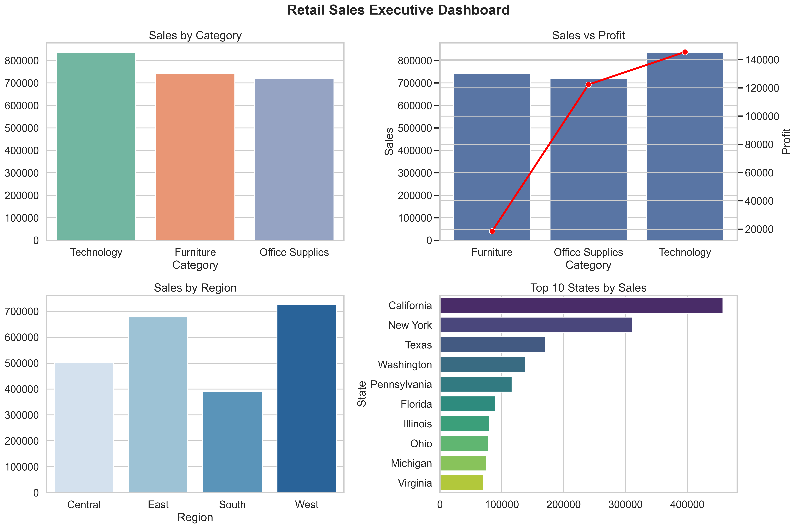

# 📊 Retail Sales Analytics Dashboard

<p align="center">


</p>

---

## 📌 Project Overview

The **Retail Sales Analytics Dashboard** is an end-to-end Data Analytics project that demonstrates the complete analytics lifecycle using **Python, SQL, and Power BI**.

The project transforms raw retail sales data into meaningful business insights through data cleaning, exploratory data analysis, SQL reporting, KPI generation, and interactive dashboards.

It is designed to simulate a real-world business analytics workflow and showcase the practical skills expected from a **Data Analyst**.

---

# 🎯 Business Problem

Retail businesses generate thousands of sales transactions every day. While this data contains valuable information, it cannot support decision-making until it is cleaned, analyzed, and visualized.

Management requires answers to business questions such as:

- Which product categories generate the highest revenue?
- Which products are the most profitable?
- Which regions contribute the highest sales?
- Which customer segments drive business growth?
- How do discounts affect profitability?
- Which states and cities should receive additional investment?
- What KPIs should executives monitor regularly?

This project answers these questions using data-driven analysis and interactive dashboards.

---

# 🎯 Project Objectives

- Build a complete end-to-end Data Analytics project.
- Clean and prepare raw retail sales data.
- Perform Exploratory Data Analysis (EDA).
- Write real-world SQL business queries.
- Generate executive-level KPIs.
- Design interactive Power BI dashboards.
- Produce actionable business insights.
- Create a professional portfolio project for Data Analyst roles.

---

# 📊 Dashboard Preview

## 📈 Sales Performance Dashboard

<p align="center">
    
</p>

---

## 💰 Profitability Dashboard

<p align="center">
    
</p>

---

## 👥 Customer & Product Analysis Dashboard

<p align="center">
    
</p>

---

## 📊 Executive Dashboard

<p align="center">
    
</p>

---

# ✨ Project Highlights

- ✅ End-to-End Data Analytics Project
- ✅ Python Data Cleaning & Analysis
- ✅ SQL Business Analysis (70+ Queries)
- ✅ Interactive Power BI Dashboard
- ✅ Executive KPI Reporting
- ✅ Business Insight Generation
- ✅ Professional GitHub Documentation
- ✅ Portfolio Ready

---

# 🛠️ Tech Stack

| Category | Technologies |
|----------|--------------|
| Programming Language | Python |
| Data Analysis | Pandas, NumPy |
| Database | MySQL |
| Data Visualization | Matplotlib, Seaborn |
| Business Intelligence | Power BI |
| Version Control | Git, GitHub |
| Development Environment | Jupyter Notebook, VS Code |

---

# 📂 Project Structure

```text
Retail-Sales-Analytics/
│
├── data/
│   ├── raw/
│   └── cleaned/
│
├── notebooks/
│   ├── Day01_Project_Setup.ipynb
│   ├── Day02_Dataset_Understanding.ipynb
│   ├── Day03_Data_Cleaning_Part1.ipynb
│   ├── Day04_Data_Cleaning_Part2.ipynb
│   ├── Day05_Feature_Engineering.ipynb
│   ├── Day06_Exploratory_Data_Analysis.ipynb
│   ├── Day11_Python_Visualization.ipynb
│   ├── Day14_Business_Insights.ipynb
│   └── Day15_Final_Project_Report.ipynb
│
├── sql/
│   ├── day07_queries.sql
│   ├── day08_queries.sql
│   ├── day09_advanced_sql.sql
│   └── day10_business_kpi.sql
│
├── powerbi/
│   └── Retail_Sales_Analytics.pbix
│
├── images/
│   ├── sales_performance_dashboard.png
│   ├── profitability_dashboard.png
│   ├── customer_product_analysis.png
│   └── executive_dashboard.png
│
├── reports/
│
├── README.md
├── requirements.txt
├── LICENSE
└── .gitignore
```

---

# 📁 Dataset Information

The project uses the **Sample Superstore Retail Dataset**, which contains transactional sales data for a retail business.

### Dataset Features

- Order ID
- Customer ID
- Customer Segment
- Product Category
- Product Sub-Category
- Sales
- Profit
- Discount
- Quantity
- Ship Mode
- State
- City
- Region

### Dataset Size

| Attribute | Value |
|-----------|------:|
| Total Records | 9,994 |
| Records After Cleaning | 9,977 |
| Features | 13 |
| Engineered Features | 3 |
| Final Dataset Columns | 16 |

---

# 🔄 Analytics Workflow

```text
Raw Dataset
      │
      ▼
Data Understanding
      │
      ▼
Data Cleaning
      │
      ▼
Feature Engineering
      │
      ▼
Exploratory Data Analysis
      │
      ▼
SQL Business Analysis
      │
      ▼
Business KPI Generation
      │
      ▼
Power BI Dashboard
      │
      ▼
Business Insights
      │
      ▼
Executive Reporting
```

---

# 🏗️ Project Architecture

```text
                 Retail Sales Dataset
                         │
                         ▼
                 Python (Pandas)
                         │
     ┌───────────────────┼───────────────────┐
     ▼                   ▼                   ▼
Data Cleaning     Feature Engineering       EDA
     │                   │                   │
     └───────────────────┼───────────────────┘
                         ▼
                    MySQL Database
                         │
                         ▼
                  Business SQL Queries
                         │
                         ▼
                  KPI Calculations
                         │
                         ▼
                 Power BI Dashboard
                         │
                         ▼
              Business Insights & Reports
```

---

# ⚙️ Installation & Setup

### 1️⃣ Clone the Repository

```bash
git clone https://github.com/your-username/Retail-Sales-Analytics.git
```

---

### 2️⃣ Navigate to the Project

```bash
cd Retail-Sales-Analytics
```

---

### 3️⃣ Create a Virtual Environment

```bash
python -m venv venv
```

---

### 4️⃣ Activate the Virtual Environment

#### Windows

```bash
venv\Scripts\activate
```

#### Linux / macOS

```bash
source venv/bin/activate
```

---

### 5️⃣ Install Dependencies

```bash
pip install -r requirements.txt
```

---

### 6️⃣ Launch Jupyter Notebook

```bash
jupyter notebook
```

Open the notebooks folder and start exploring the project.

---

# 🗄️ SQL Business Analysis

The project includes **70+ real-world SQL queries** that simulate business reporting and analytical tasks performed by Data Analysts.

### SQL Topics Covered

- Database Creation
- Table Design
- Data Import
- Aggregate Functions
- GROUP BY
- HAVING
- ORDER BY
- LIMIT
- CASE WHEN
- String Functions
- Subqueries
- Correlated Subqueries
- Common Table Expressions (CTEs)
- Window Functions
- Ranking Functions
- Running Totals
- Executive KPI Queries

### Business Problems Solved

- Sales Analysis
- Profitability Analysis
- Regional Performance
- Customer Analysis
- Product Performance
- Executive KPI Reporting
- Top & Bottom Product Analysis
- State-wise & City-wise Analysis
- Customer Segmentation

---

# 🐍 Python Analysis

Python was used to perform complete data preprocessing, analysis, visualization, and business reporting.

### Data Processing

- Data Loading
- Data Cleaning
- Duplicate Removal
- Data Validation
- Feature Engineering

### Exploratory Data Analysis (EDA)

- Statistical Summary
- Distribution Analysis
- Category Analysis
- Customer Segment Analysis
- Regional Analysis
- Correlation Analysis
- Outlier Detection

### Business Analytics

- KPI Generation
- Business Insight Generation
- Executive Reporting
- Business Recommendations

### Libraries Used

- Pandas
- NumPy
- Matplotlib
- Seaborn

---

# 📊 Power BI Dashboard

The project includes a professional multi-page Power BI dashboard for interactive business analysis.

### Dashboard Pages

### 📈 Sales Performance

- Total Sales KPI
- Total Orders
- Total Quantity
- Average Sales
- Sales by Category
- Sales by Region
- Top 10 States
- Top 10 Cities

---

### 💰 Profitability Analysis

- Total Profit KPI
- Profit Margin %
- Profit by Category
- Profit by Region
- Profit by Sub-Category
- Top 10 States by Profit

---

### 👥 Customer & Product Analysis

- Customer Segment Analysis
- Shipping Mode Analysis
- Product Category Analysis
- Product Sub-Category Analysis
- Quantity Analysis
- Profit Margin Analysis

---

### Dashboard Features

- Interactive Slicers
- Dynamic Filtering
- KPI Cards
- Top N Analysis
- Professional Theme
- Multi-page Navigation

---

# 📈 Executive KPIs

The project calculates the following business KPIs:

| KPI |
|------|
| Total Sales |
| Total Profit |
| Total Orders |
| Total Customers |
| Total Quantity Sold |
| Average Sales per Order |
| Average Profit per Order |
| Average Discount |
| Profit Margin % |

---

# 💡 Key Business Insights

The analysis generated several actionable business insights, including:

- Technology products generated the highest revenue.
- Profitability varies significantly across product categories.
- The West region contributed the highest sales and profit.
- Consumer customers generated the highest revenue.
- Standard Class was the most preferred shipping mode.
- Some sub-categories consistently generated losses despite strong sales.
- Higher discounts did not always increase profitability.
- Sales and profit distribution varied significantly across states and cities.
- Customer segmentation revealed different purchasing behaviors.
- Business KPIs can effectively monitor organizational performance.

---

# 🏆 Project Outcomes

By completing this project, the following outcomes were achieved:

- Built a complete end-to-end Data Analytics solution.
- Performed professional data cleaning and preprocessing.
- Solved real-world business problems using SQL.
- Created executive-level KPI reports.
- Designed an interactive Power BI dashboard.
- Generated actionable business recommendations.
- Developed a portfolio-ready analytics project.

---

# 📊 Project Statistics

| Metric | Value |
|---------|------:|
| Project Duration | 16 Days |
| SQL Queries | 70+ |
| Jupyter Notebooks | 15 |
| Power BI Dashboard Pages | 3 |
| Business Insights | 10 |
| KPI Metrics | 8 |
| Dashboard Screens | 4 |
| Technologies Used | 7 |

---

# 💼 Skills Demonstrated

This project showcases the following technical and analytical skills:

### Data Analysis

- Data Cleaning
- Data Validation
- Exploratory Data Analysis (EDA)
- Feature Engineering
- Statistical Analysis
- Business KPI Analysis

### SQL

- Joins
- Aggregate Functions
- GROUP BY
- HAVING
- CASE WHEN
- Subqueries
- Correlated Subqueries
- Common Table Expressions (CTEs)
- Window Functions
- Ranking Functions
- Business Reporting

### Power BI

- Data Modeling
- DAX Measures
- KPI Cards
- Interactive Dashboards
- Slicers
- Data Visualization
- Executive Dashboard Design

### Python

- Pandas
- NumPy
- Matplotlib
- Seaborn
- Jupyter Notebook

### Tools

- MySQL
- Git
- GitHub
- VS Code

---

# 📚 Learning Outcomes

By completing this project, I gained practical experience in:

- Building an end-to-end Data Analytics pipeline.
- Cleaning and transforming real-world datasets.
- Writing business-focused SQL queries.
- Performing Exploratory Data Analysis.
- Designing interactive Power BI dashboards.
- Creating executive-level KPI reports.
- Converting data into actionable business insights.
- Documenting projects using Git and GitHub.

---

# 🚀 Future Enhancements

Planned improvements for future versions of this project include:

- Sales Forecasting using Machine Learning
- Customer Segmentation
- Product Recommendation System
- Interactive Streamlit Dashboard
- Automated Reporting
- Cloud Deployment
- Real-Time Data Integration

---

# 🤝 Contributing

Contributions are welcome!

If you have suggestions for improvements, feel free to:

1. Fork this repository.
2. Create a new feature branch.
3. Commit your changes.
4. Open a Pull Request.

---

# 📄 License

This project is licensed under the **MIT License**.

Feel free to use this project for learning, educational purposes, and portfolio inspiration.

---

# 👨‍💻 Author

## Nimish Patel

**B.Tech, NIT Raipur**

Aspiring Data Analyst | Python | SQL | Power BI | Data Visualization

### Connect With Me

- **GitHub:** https://github.com/nimish9335
- **LinkedIn:** *(Add your LinkedIn profile here)*

---

# ⭐ Support

If you found this project useful, consider giving it a ⭐ on GitHub.

Your support motivates me to build more real-world data analytics projects.

---

<p align="center">
<b>⭐ Thank you for visiting this repository! ⭐</b>
</p>