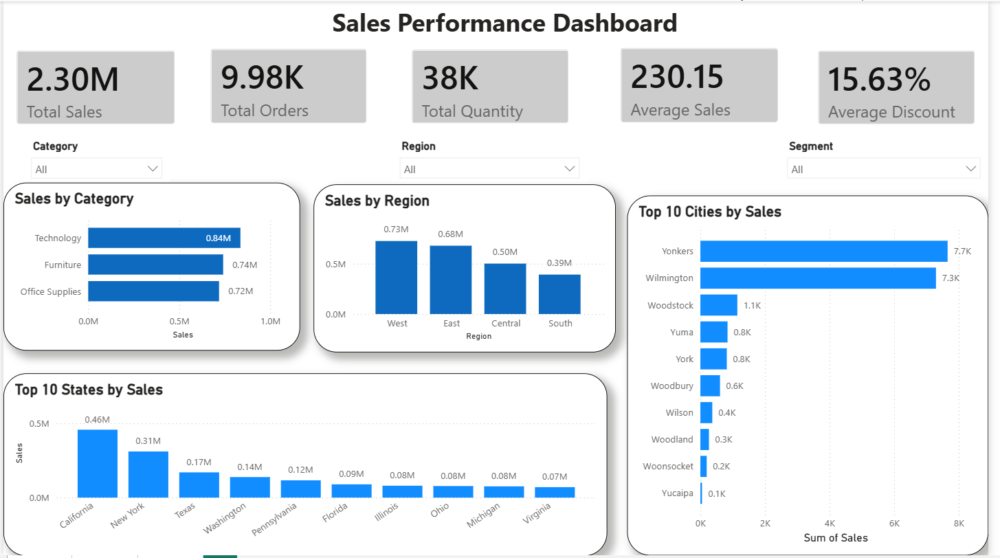
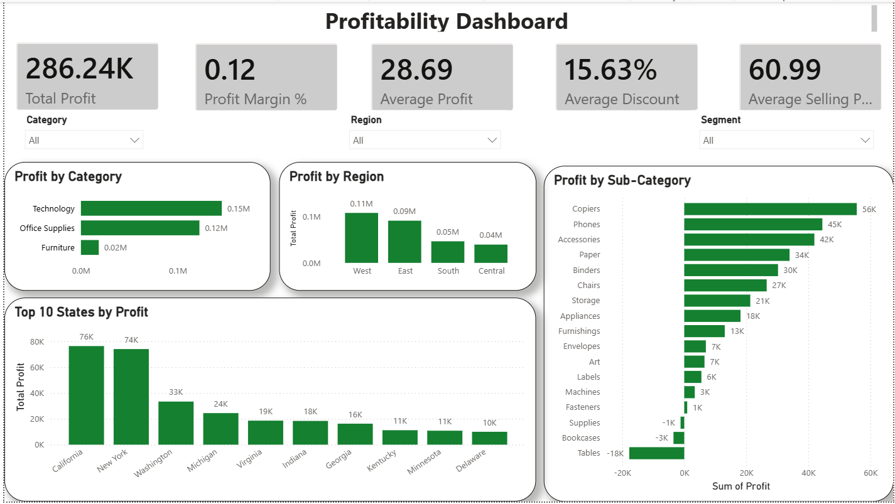
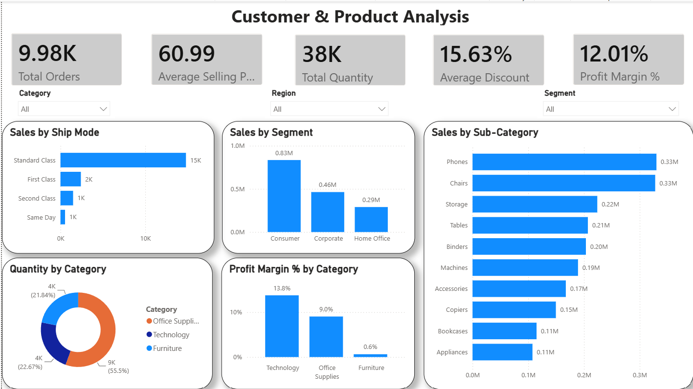

# 📊 Retail Sales Analytics Dashboard

> An end-to-end Data Analytics project focused on transforming raw retail sales data into meaningful business insights using **Python, Pandas, SQL, and Power BI**.

---

# 📌 Project Overview

Retail organizations generate thousands of sales transactions every day. Making informed business decisions from this raw data requires proper data cleaning, exploration, analysis, and visualization.

This project follows the complete workflow of a professional Data Analyst by converting raw retail sales data into actionable business insights through Python, SQL, and Power BI.

The objective is not only to build dashboards but also to understand the complete analytics pipeline followed in the industry.

---

## 📸 Dashboard Preview

### 📈 Sales Performance Dashboard

<p align="center">
  
</p>

---

### 💰 Profitability Dashboard

<p align="center">
  
</p>

---

### 👥 Customer & Product Analysis

<p align="center">
  
</p>

# 🎯 Project Objectives

- Build a complete end-to-end Data Analytics project.
- Learn industry-standard analytics workflow.
- Perform real-world data cleaning.
- Analyze business performance using SQL.
- Build interactive Power BI dashboards.
- Generate business KPIs.
- Improve analytical thinking.
- Build a placement-ready portfolio project.
- Prepare for Data Analyst interviews.

---

# 💼 Business Problem

The retail industry handles massive amounts of transactional data every day.

Management wants answers to questions like:

- Which products generate maximum revenue?
- Which categories are profitable?
- Which regions perform the best?
- Which customers contribute the most revenue?
- Which products should be promoted?
- Which products are causing losses?
- How are monthly sales changing?
- How can profit be increased?

This project aims to answer these questions using data-driven analysis.

---

# 📂 Dataset

The project uses a Retail Sales dataset containing information about:

- Orders
- Customers
- Products
- Categories
- Sales
- Profit
- Discount
- Quantity
- Regions
- States
- Cities
- Order Dates
- Shipping Dates

The dataset will first be cleaned and then analyzed.

---

# 🛠 Tech Stack

## Programming

- Python

## Data Analysis

- Pandas
- NumPy

## Database

- MySQL

## Visualization

- Matplotlib
- Seaborn

## Business Intelligence

- Power BI

## Version Control

- Git
- GitHub

---

# 📂 Folder Structure

```text
Retail-Sales-Analytics/

│
├── data/
│   ├── raw/
│   └── cleaned/
│
├── notebooks/
│
├── sql/
│
├── powerbi/
│
├── reports/
│
├── images/
│
├── README.md
│
├── requirements.txt
│
└── .gitignore
```

---

# 🏗 Project Workflow

```text
Dataset Collection
        │
        ▼
Data Understanding
        │
        ▼
Data Cleaning
        │
        ▼
Feature Engineering
        │
        ▼
Exploratory Data Analysis
        │
        ▼
SQL Analysis
        │
        ▼
Business KPI Generation
        │
        ▼
Power BI Dashboard
        │
        ▼
Business Insights
        │
        ▼
Documentation
```

---

# 📅 Development Workflow

Every development day follows the same workflow.

```text
Theory
    │
    ▼
Implementation
    │
    ▼
Testing
    │
    ▼
Business Insights
    │
    ▼
README Update
    │
    ▼
Git Commit
    │
    ▼
Git Push
```

A day is considered completed only after all the above steps are finished.

---

# 📖 Project Roadmap

## Week 1

- Day 1 → Project Setup
- Day 2 → Dataset Understanding
- Day 3 → Data Cleaning (Part 1)
- Day 4 → Data Cleaning (Part 2)

---

## Week 2

- Day 5 → Feature Engineering
- Day 6 → Exploratory Data Analysis
- Day 7 → SQL Database Setup
- Day 8 → SQL Business Queries

---

## Week 3

- Day 9 → Advanced SQL Analysis
- Day 10 → Business KPI Analysis
- Day 11 → Python Visualizations
- Day 12 → Power BI Dashboard

---

## Week 4

- Day 13 → Dashboard Enhancement
- Day 14 → Business Insights
- Day 15 → Testing & Documentation
- Day 16 → Final Review & GitHub

---

# 📈 Progress Tracker

- [x] Day 1 - Project Setup
- [x] Day 2 - Dataset Understanding
- [x] Day 3 - Data Cleaning (Part 1)
- [x] Day 4 - Data Cleaning (Part 2)
- [x] Day 5 - Feature Engineering
- [x] Day 6 - Exploratory Data Analysis
- [x] Day 7 - SQL Database Setup
- [x] Day 8 - SQL Business Queries
- [x] Day 9 - Advanced SQL Analysis
- [x] Day 10 - Business KPI Analysis
- [x] Day 11 - Python Visualizations
- [x] Day 12 - Power BI Dashboard
- [x] Day 13 - Dashboard Enhancement
- [ ] Day 14 - Business Insights
- [ ] Day 15 - Testing & Documentation
- [ ] Day 16 - Final Review & GitHub

---

# 🚀 Project Deliverables

At the end of this project, the following deliverables will be available.

- Cleaned Dataset
- Python Analysis Notebook
- SQL Scripts
- Power BI Dashboard
- Business KPI Report
- Business Insights Report
- Professional GitHub Repository
- Resume-ready Project

---

# 📚 Development Rules

- Never skip theory before implementation.
- Complete one day before moving to the next.
- Commit code after every completed day.
- Update README after every completed day.
- Keep notebooks clean and well documented.
- Focus on solving business problems rather than only writing code.
- Maintain a professional GitHub repository.

---

# 🚀 Future Enhancements

- Sales Forecasting
- Customer Segmentation
- Product Recommendation System
- Streamlit Dashboard
- Machine Learning Models
- Cloud Deployment
- Automated Reporting

---

# 🎯 Target Outcome

After completing this project, you should be able to:

- Clean real-world datasets.
- Perform Exploratory Data Analysis.
- Write business SQL queries.
- Build interactive Power BI dashboards.
- Generate business insights.
- Explain every step confidently during interviews.
- Showcase a production-ready Data Analytics project on GitHub.

---

---

# 📅 Development Log

This section documents the complete development journey of the project.

Each day records:

- Objective
- Tasks Completed
- Files Created / Modified
- Concepts Learned
- Today's Learning
- Business Impact
- Testing
- Notes
- Interview Questions
- Git Commit

The development log will grow as the project progresses.

---

# ✅ Day 1 - Project Setup

## 🎯 Objective

Set up the complete project structure and development environment for the Retail Sales Analytics project.

---

## ✅ Tasks Completed

* Created the project repository.
* Organized the folder structure for data, notebooks, SQL scripts, Power BI files, reports, and images.
* Created the required project files:

  * `README.md`
  * `requirements.txt`
  * `.gitignore`
* Created and activated a Python virtual environment.
* Installed all required Python libraries.
* Generated `requirements.txt` using `pip freeze`.
* Created the initial Jupyter notebook:

  * `Day01_Project_Setup.ipynb`
* Initialized the project for future development.

---

## 📁 Files Created / Modified

* `README.md`
* `requirements.txt`
* `.gitignore`
* `notebooks/Day01_Project_Setup.ipynb`

---

## 📚 Concepts Learned

* Professional Data Analytics project structure
* Python virtual environments
* Dependency management with `requirements.txt`
* Git repository organization
* Importance of reproducible project environments

---

## 💡 Today's Learning

A well-structured project is the foundation of every professional analytics workflow. Proper folder organization, dependency management, and version control make projects easier to maintain, collaborate on, and scale.

---

## 📈 Business Impact

Although no business analysis was performed today, establishing a standardized project structure ensures that future data cleaning, analysis, visualization, and reporting can be completed efficiently and reproducibly.

---

## 🧪 Testing

Completed the following verification successfully:

* Virtual environment activation
* Python library installation
* Jupyter Notebook setup
* Project folder structure
* Git repository initialization

All tests passed successfully.

---

## 📝 Notes

Day 1 focused entirely on project initialization and environment setup. No data analysis or visualization was performed.

---

## 🎤 Interview Questions

1. Why do we use a virtual environment in Python?
2. What is the purpose of `requirements.txt`?
3. Why should raw datasets remain unchanged?
4. Why is Git important in analytics projects?
5. What are the advantages of a well-organized project structure?

---


# ✅ Day 2 - Dataset Understanding

## 🎯 Objective

Understand the dataset structure, inspect its contents, verify data quality, and gain an initial business understanding before starting the data cleaning process.

---

## ✅ Tasks Completed

- Downloaded and organized the retail sales dataset.
- Loaded the dataset into a Pandas DataFrame.
- Explored the dataset using basic Pandas functions.
- Checked the dataset dimensions and column names.
- Inspected data types and memory usage.
- Generated statistical summaries for numerical columns.
- Analyzed categorical columns.
- Verified missing values.
- Identified duplicate records.
- Performed an initial business understanding of the dataset.

---

## 📁 Files Created / Modified

- `notebooks/Day02_Dataset_Understanding.ipynb`

---

## 📚 Concepts Learned

- Loading datasets using Pandas
- Understanding dataset dimensions
- Identifying numerical and categorical features
- Interpreting statistical summaries
- Inspecting data quality
- Detecting duplicate records
- Initial business understanding of retail data

---

## 💡 Today's Learning

Before performing any data cleaning or visualization, it is essential to understand the dataset. Inspecting its structure, data types, summary statistics, and quality helps identify potential issues and supports informed analytical decisions.

---

## 📈 Business Impact

The dataset represents retail sales transactions across different product categories, customer segments, cities, states, and regions within the United States.

Initial exploration revealed:

- No missing values across all columns.
- 17 duplicate records that require cleaning.
- Office Supplies is the most frequently sold product category.
- Consumer is the largest customer segment.
- Sales, Discount, and Profit will be the primary metrics for business analysis in the upcoming phases.

---

## 🧪 Testing

Successfully verified:

- Dataset loaded correctly.
- Dataset contains **9,994 rows** and **13 columns**.
- No missing values found.
- 17 duplicate records detected.
- Data types correctly identified by Pandas.

All verification checks passed successfully.

---

## 📝 Notes

Day 2 focused entirely on understanding the dataset before performing any modifications. No cleaning or transformation was applied. The original dataset remains unchanged and will be used as the source for the cleaning process in Day 3.

---

## 🎤 Interview Questions

1. What is the difference between `df.info()` and `df.describe()`?
2. Why is dataset understanding important before data cleaning?
3. How do you identify missing values in Pandas?
4. How can duplicate records be detected in Pandas?
5. What is the difference between numerical and categorical columns?

---

## 💻 Pandas Functions Practiced

- `pd.read_csv()`
- `head()`
- `shape`
- `columns`
- `info()`
- `describe()`
- `describe(include="object")`
- `isnull().sum()`
- `duplicated().sum()`
- `dtypes`

---

## ✅ Status

**Completed**

---

# ✅ Day 3 - Data Cleaning (Part 1)

## 🎯 Objective

Perform the first phase of data cleaning by preserving the raw dataset, creating a working copy, identifying duplicate records, removing them, validating the cleaned data, and saving a cleaned version for further analysis.

---

## ✅ Tasks Completed

- Created a working copy of the original dataset using `df.copy()`.
- Verified that the original dataset remained unchanged.
- Identified duplicate records.
- Inspected duplicate rows before deletion.
- Removed duplicate records from the working dataset.
- Verified that all duplicates were successfully removed.
- Saved the cleaned dataset into the `data/cleaned/` directory.
- Loaded the cleaned dataset again for validation.
- Verified dataset integrity after cleaning.

---

## 📁 Files Created / Modified

- `notebooks/Day03_Data_Cleaning_Part1.ipynb`
- `data/cleaned/SampleSuperstore_Cleaned.csv`

---

## 📚 Concepts Learned

- Importance of preserving raw datasets
- Working with DataFrame copies
- Duplicate detection
- Duplicate removal
- Dataset validation
- Saving cleaned datasets
- Reproducible data cleaning workflow

---

## 💡 Today's Learning

Data cleaning should never be performed on the original dataset. Creating a working copy ensures data safety and allows the cleaning process to remain reproducible. Validation after cleaning confirms that the processed dataset is accurate and ready for analysis.

---

## 📈 Business Impact

Removing duplicate records improves data quality and prevents incorrect business metrics.

Benefits include:

- Accurate sales calculations
- Correct profit analysis
- Reliable KPI generation
- Trustworthy dashboards
- Better business decision-making

---

## 🧪 Testing

Successfully verified:

- Working copy created successfully.
- Original dataset remained unchanged.
- Duplicate records detected.
- Duplicate records reduced from **17** to **0**.
- Cleaned dataset saved successfully.
- Validation confirmed the cleaned dataset contains **9,977 rows** and **13 columns**.
- No missing values introduced during cleaning.

All validation checks passed successfully.

---

## 📝 Notes

The cleaned dataset has been saved separately while preserving the original dataset. This follows industry best practices for maintaining reproducible and reliable analytics pipelines.

---

## 🎤 Interview Questions

1. Why should raw datasets never be modified directly?
2. What is the difference between `df.copy()` and simple assignment (`=`)?
3. Why should duplicate records be inspected before removal?
4. How do you validate a cleaned dataset?
5. Why should cleaned datasets be stored separately from raw data?

---

## 💻 Pandas Functions Practiced

- `copy()`
- `duplicated()`
- `drop_duplicates()`
- `to_csv()`
- `read_csv()`
- `shape`
- `isnull().sum()`
- `dtypes`
- `head()`

---

## ✅ Status

**Completed**

---

# ✅ Day 4 - Data Cleaning (Part 2)

## 🎯 Objective

Perform the second phase of data cleaning by validating data quality, inspecting numerical and categorical columns, standardizing text data, verifying business rules, and creating a final analysis-ready dataset.

---

## ✅ Tasks Completed

- Loaded the cleaned dataset from Day 3.
- Created a working copy of the dataset.
- Inspected data types and dataset information.
- Validated numerical columns using descriptive statistics.
- Verified business rules for Sales, Quantity, Discount, and Profit.
- Standardized text columns by removing leading and trailing spaces.
- Validated categorical columns using `unique()` and `value_counts()`.
- Performed final dataset validation.
- Saved the final cleaned dataset for feature engineering.

---

## 📁 Files Created / Modified

- `notebooks/Day04_Data_Cleaning_Part2.ipynb`
- `data/cleaned/SampleSuperstore_Cleaned_Final.csv`

---

## 📚 Concepts Learned

- Data validation
- Business rule validation
- Text standardization
- Categorical data validation
- Numerical data inspection
- Dataset quality assurance
- Analysis-ready dataset preparation

---

## 💡 Today's Learning

Data cleaning is more than removing duplicates. Before analysis, datasets should be validated for numerical correctness, consistent categorical values, appropriate formatting, and overall data quality. These validation steps improve the reliability of future business analysis and dashboards.

---

## 📈 Business Impact

Validating the dataset ensures:

- Accurate business KPIs
- Reliable sales and profit analysis
- Consistent category-based reporting
- Cleaner Power BI dashboards
- Trustworthy business insights

---

## 🧪 Testing

Successfully verified:

- Dataset shape remained **(9977, 13)**.
- No missing values found.
- No duplicate records found.
- Numerical columns satisfied business rules.
- Text columns were standardized successfully.
- Categorical values were consistent.
- Final cleaned dataset saved successfully.

All validation checks passed successfully.

---

## 📝 Notes

The dataset has now been fully validated and standardized. It is analysis-ready and will be used as the foundation for Feature Engineering in Day 5.

---

## 🎤 Interview Questions

1. What is data validation?
2. Why is text standardization important?
3. Why should business rules be validated before analysis?
4. What is the purpose of `value_counts()`?
5. How do you verify that a dataset is analysis-ready?

---

## 💻 Pandas Functions Practiced

- `describe()`
- `select_dtypes()`
- `unique()`
- `value_counts()`
- `str.strip()`
- `isnull().sum()`
- `duplicated()`
- `dtypes`
- `to_csv()`
- `read_csv()`

---

## ✅ Status

**Completed**

---

# ✅ Day 5 - Feature Engineering

## 🎯 Objective

Create new business features from the cleaned dataset to improve analytical capabilities and simplify future SQL analysis, KPI generation, and Power BI dashboard development.

---

## ✅ Tasks Completed

- Loaded the final cleaned dataset.
- Created a working copy for feature engineering.
- Created the **Profit Margin (%)** feature.
- Created the **Average Selling Price** feature.
- Created the **Discount Percentage** feature.
- Validated all newly created features.
- Verified there were no missing values introduced.
- Saved the feature-engineered dataset for future analysis.

---

## 📁 Files Created / Modified

- `notebooks/Day05_Feature_Engineering.ipynb`
- `data/cleaned/SampleSuperstore_Feature_Engineered.csv`

---

## 📚 Concepts Learned

- Feature Engineering
- Derived business metrics
- Vectorized operations in Pandas
- Business KPI preparation
- Creating new DataFrame columns
- Dataset validation after feature creation

---

## 💡 Today's Learning

Feature Engineering transforms raw business data into meaningful analytical features. Instead of repeatedly calculating important business metrics during analysis, creating derived features beforehand improves efficiency, consistency, and readability across SQL queries, dashboards, and reports.

---

## 📈 Business Impact

The engineered features provide additional business insights:

- **Profit Margin (%)** helps evaluate product profitability.
- **Average Selling Price** helps understand pricing patterns.
- **Discount Percentage** simplifies discount analysis and reporting.

These features will be valuable for Exploratory Data Analysis, SQL reporting, KPI generation, and Power BI dashboards.

---

## 🧪 Testing

Successfully verified:

- Profit Margin (%) calculated correctly.
- Average Selling Price calculated correctly.
- Discount Percentage calculated correctly.
- Dataset expanded from **13** to **16** columns.
- No missing values introduced.
- No duplicate records created.
- Feature-engineered dataset saved successfully.

All validation checks passed successfully.

---

## 📝 Notes

The dataset now contains engineered business features that simplify future analysis. These derived metrics eliminate repetitive calculations and improve consistency across analytical workflows.

---

## 🎤 Interview Questions

1. What is Feature Engineering?
2. Why is Feature Engineering important in Data Analytics?
3. What is Profit Margin and how is it calculated?
4. What is Average Selling Price?
5. Why should derived features be created before visualization?

---

## 💻 Pandas Functions Practiced

- `copy()`
- Column creation using vectorized operations
- `round()`
- `describe()`
- `head()`
- `isnull().sum()`
- `to_csv()`
- `read_csv()`

---

## ✅ Status

**Completed**

---

# ✅ Day 6 (Completed)

## Objective

Perform Exploratory Data Analysis (EDA) on the cleaned and feature-engineered retail sales dataset to identify business trends, customer behavior, geographical performance, and profitability insights through statistical analysis and data visualization.

---

## Topics Covered

- Dataset Overview
- Data Quality Verification
- Statistical Summary
- Numerical Feature Distribution
- Category Analysis
- Sub-Category Analysis
- Customer Segment Analysis
- Regional Analysis
- State-wise Analysis
- City-wise Analysis
- Discount Analysis
- Correlation Analysis
- Sales vs Profit Analysis
- Boxplot Analysis
- Business Insights Generation

> **Note:** Monthly Sales Trend and Monthly Profit Trend analysis were skipped because the feature-engineered dataset did not contain the `Order Date` column.

---

## Tasks Completed

### Dataset Exploration

- Loaded the feature-engineered dataset.
- Created a working copy for EDA.
- Examined dataset shape, columns, data types, and descriptive statistics.
- Verified that the dataset contained no missing values or duplicate records.

### Distribution Analysis

- Analyzed the distribution of Sales, Profit, Quantity, Discount, Profit Margin (%), Average Selling Price, and Discount Percentage.
- Identified skewed distributions and high-value transactions using histograms.

### Category & Product Analysis

- Analyzed order count by Category.
- Calculated total Sales by Category.
- Calculated total Profit by Category.
- Evaluated Sales and Profit for each Sub-Category.
- Identified high-performing and low-performing product groups.

### Customer Segment Analysis

- Compared order distribution across customer segments.
- Analyzed Sales by Segment.
- Analyzed Profit by Segment.

### Geographical Analysis

- Compared Sales and Profit across Regions.
- Identified the top-performing States by Sales and Profit.
- Identified the top-performing Cities by Sales and Profit.

### Discount Analysis

- Calculated average Discount by Category.
- Visualized Discount distribution.
- Studied the relationship between Discount and Profit using a scatter plot.

### Correlation Analysis

- Computed the correlation matrix for numerical features.
- Visualized feature relationships using a heatmap.
- Interpreted positive and negative correlations.

### Sales vs Profit Analysis

- Examined the relationship between Sales and Profit using a scatter plot.
- Identified profitable and loss-making transactions.

### Outlier Detection

- Used boxplots to detect outliers in:
  - Sales
  - Profit
  - Discount
  - Quantity

### Business Insights

- Summarized analytical findings into actionable business insights.
- Identified profitable markets, product categories, and customer segments.
- Highlighted the impact of discounts on profitability.

---

## Key Learnings

- Performed end-to-end Exploratory Data Analysis using Pandas and Seaborn.
- Applied aggregation techniques using `groupby()`.
- Created business-focused visualizations using Matplotlib and Seaborn.
- Interpreted statistical summaries and data distributions.
- Identified business trends through geographical and customer analysis.
- Understood how discounts influence profitability.
- Detected outliers and interpreted feature correlations.
- Converted analytical findings into meaningful business recommendations.

---

## Deliverables

- Exploratory Data Analysis Notebook
- Business Visualizations
- Statistical Summary
- Business Insights Report
- Updated Project Documentation

---

## Status

✅ Day 6 Completed Successfully

---

### Day 7: MySQL Database Setup & SQL Analytics Fundamentals

#### 🎯 Objective
Set up a MySQL database, import the cleaned retail sales dataset, and perform SQL-based business analysis using aggregate functions, grouping, sorting, and filtering techniques.

#### 📚 Topics Covered
- MySQL Database Setup
- Table Creation
- CSV Data Import
- Data Verification
- Aggregate Functions
- GROUP BY
- ORDER BY
- LIMIT
- DISTINCT
- Business KPI Analysis
- Business Case Study Queries

#### ✅ Tasks Completed

##### 1. Database Setup
- Created a new MySQL database (`retail_sales_db`).
- Selected the database for analysis.
- Verified database creation.

##### 2. Table Creation
- Designed the `retail_sales` table.
- Selected appropriate SQL data types for each feature.
- Created the table using `CREATE TABLE`.
- Verified table schema using `DESCRIBE`.

##### 3. Data Import
- Imported the cleaned feature-engineered CSV dataset into MySQL.
- Verified successful import by checking sample records.
- Confirmed total record count matched the cleaned dataset.

##### 4. Data Validation
- Verified table structure.
- Checked for missing (NULL) values.
- Ensured imported data integrity before analysis.

##### 5. Aggregate Functions
Practiced SQL aggregate functions:
- COUNT()
- SUM()
- AVG()
- MIN()
- MAX()
- ROUND()

Calculated:
- Total Sales
- Total Profit
- Average Sales
- Average Profit
- Average Discount
- Average Quantity
- Highest Sale
- Lowest Sale
- Highest Profit
- Biggest Loss

##### 6. GROUP BY Analysis
Performed grouped business analysis for:
- Category
- Region
- Customer Segment
- State
- Sub-Category

Calculated:
- Total Sales
- Total Profit
- Average Sales
- Average Profit
- Order Counts

##### 7. ORDER BY & LIMIT
Generated ranked business reports:
- Top 5 States by Sales
- Top 5 States by Profit
- Top 10 Cities by Sales
- Top 10 Cities by Profit
- Top 5 Most Profitable Sub-Categories
- Bottom 5 Loss-Making Sub-Categories

##### 8. DISTINCT Operations
Retrieved unique values for:
- Categories
- Regions
- Customer Segments

Calculated:
- Number of Unique Cities

##### 9. Business Case Study Queries
Solved real-world business questions such as:
- Highest profit generating category
- Region with highest average sales
- Segment with maximum quantity sold
- Sub-category with highest average discount
- States with highest sales and profit
- Top and bottom performing cities
- Category-wise average profit margin
- Region-wise average discount
- Segment-wise average selling price
- Top and bottom sub-categories by quantity sold
- Orders by region
- Average sales and profit by ship mode

#### 💡 Key Learnings
- Understood SQL database creation and table design.
- Learned how to import CSV datasets into MySQL.
- Validated imported data before analysis.
- Mastered SQL aggregate functions.
- Learned data grouping using `GROUP BY`.
- Generated ranked reports using `ORDER BY` and `LIMIT`.
- Retrieved unique information using `DISTINCT`.
- Solved multiple real-world business analytics problems using SQL.
- Improved SQL query writing and analytical thinking.

#### 📂 Deliverables
- MySQL Database (`retail_sales_db`)
- `retail_sales` SQL Table
- Imported Retail Sales Dataset
- `sql/schema.sql`
- `sql/day07_queries.sql`
- Business KPI Queries
- Business Case Study Queries

#### 🚀 Status
✅ Day 7 Completed Successfully

---

### Day 8: Advanced SQL for Data Analysis

#### 🎯 Objective
Learn advanced SQL techniques for filtering, conditional logic, grouping, and solving real-world business problems using SQL.

#### 📚 Topics Covered
- WHERE Clause
- Comparison Operators
- BETWEEN
- IN
- LIKE
- Logical Operators (AND, OR, NOT)
- HAVING Clause
- CASE WHEN
- String Functions
- Business Case Study Queries

#### ✅ Tasks Completed

##### 1. WHERE Clause
Filtered records based on:
- Category
- Region
- Segment
- Sales
- Profit
- Discount
- Quantity

##### 2. Comparison Operators
Applied:
- >
- <
- >=
- <=
- =
- !=
- BETWEEN
- IN
- NOT IN

##### 3. LIKE Operator
Performed pattern matching using:
- Starts With
- Ends With
- Contains

##### 4. Logical Operators
Built conditional queries using:
- AND
- OR
- NOT

##### 5. HAVING Clause
Filtered grouped results after aggregation.

Performed analysis on:
- Categories
- Regions
- States
- Cities
- Customer Segments
- Sub-Categories

##### 6. WHERE + GROUP BY + HAVING
Combined filtering and aggregation to answer business questions.

##### 7. CASE WHEN
Created custom business categories for:
- Profit Levels
- Discount Levels

Generated summarized reports using conditional logic.

##### 8. String Functions
Practiced:
- UPPER()
- LOWER()
- LENGTH()
- CONCAT()

##### 9. Business Case Study Queries
Solved multiple real-world business questions including:
- Highest average sales
- Highest average profit
- Highest average discount
- Highest average selling price
- Ship mode performance
- State-wise average sales
- City-wise average profit
- Region-wise quantity analysis
- Category maximum sales
- Sub-category maximum profit
- Dashboard KPI generation

#### 💡 Key Learnings
- Mastered SQL filtering techniques.
- Learned advanced conditional querying.
- Used HAVING for aggregate filtering.
- Applied CASE WHEN for business classification.
- Performed string manipulation using SQL functions.
- Solved real-world business analytics problems.
- Improved SQL problem-solving skills.

#### 📂 Deliverables
- sql/day08_queries.sql
- Advanced SQL Practice Queries
- Business Case Study Queries
- Dashboard KPI Queries

#### 🚀 Status
✅ Day 8 Completed Successfully

---

# ✅ Day 9 - Advanced SQL Analysis

## 🎯 Objective

Perform advanced SQL analysis using industry-standard SQL techniques to solve complex business problems. Learn advanced querying methods including Subqueries, Correlated Subqueries, Common Table Expressions (CTEs), Window Functions, Ranking Functions, Running Totals, and Executive KPI analysis.

---

## 📚 Topics Covered

- Subqueries
- Correlated Subqueries
- Common Table Expressions (CTEs)
- Window Functions
- ROW_NUMBER()
- RANK()
- DENSE_RANK()
- NTILE()
- LAG()
- LEAD()
- Running Totals
- Running Average
- Percentage Contribution
- Business KPI Analysis
- Executive Dashboard Queries

---

## ✅ Tasks Completed

### 1. Subqueries

- Retrieved records using scalar subqueries.
- Compared sales and profit against overall averages.
- Identified high-performing states, customers, and product categories.
- Solved aggregate-based business problems using nested queries.

### 2. Correlated Subqueries

- Compared each record with the average of its respective group.
- Analyzed category-wise sales performance.
- Compared customer purchases against their own averages.
- Evaluated region, state, and segment-level performance.

### 3. Common Table Expressions (CTEs)

- Created reusable SQL query blocks.
- Generated category-wise sales reports.
- Built regional profit summaries.
- Created state and city performance reports.
- Generated customer and product analysis reports.

### 4. Window Functions

Implemented advanced analytical SQL functions including:

- ROW_NUMBER()
- RANK()
- DENSE_RANK()
- NTILE()
- LAG()
- LEAD()
- Running Total
- Running Average
- Cumulative Quantity

Applied partitioning to generate:

- Category-wise rankings
- Region-wise rankings
- Top products
- Top customers
- Running business metrics

### 5. Advanced Business Case Studies

Solved multiple real-world business problems including:

- Top Customers by Sales
- Revenue Contribution by Category
- Profit Contribution by Region
- Top Selling Products
- Most Profitable Products
- Top Cities by Sales
- Bottom Cities by Profit
- Category-wise Profit Margin
- Regional Discount Analysis
- High Value Customers
- Loss Making Products
- Executive Dashboard KPIs

---

## 📁 Files Created / Modified

- `sql/day09_advanced_sql.sql`

---

## 📚 Concepts Learned

- Advanced SQL Query Writing
- Nested Queries
- Correlated Queries
- Common Table Expressions (CTEs)
- Window Functions
- SQL Ranking Functions
- Running Calculations
- Analytical Reporting
- Business KPI Generation
- Executive Dashboard Metrics

---

## 💡 Today's Learning

Advanced SQL enables analysts to solve complex business problems efficiently. Features such as CTEs and Window Functions simplify query logic, improve readability, and support advanced analytical reporting. These concepts are widely used in real-world business intelligence, reporting systems, and dashboard development.

---

## 📈 Business Impact

The advanced SQL analysis provided valuable business insights by:

- Identifying top-performing customers and products.
- Measuring revenue and profit contribution across categories and regions.
- Ranking products, customers, and regions based on business performance.
- Detecting loss-making products.
- Generating executive-level KPIs for management dashboards.
- Supporting data-driven business decision making.

---

## 🧪 Testing

Successfully verified:

- All subqueries executed correctly.
- Correlated subqueries produced expected results.
- CTE reports generated successfully.
- Window Functions returned accurate rankings and running calculations.
- Business KPI queries executed without errors.
- Executive Dashboard queries generated consolidated business metrics.

All validation checks passed successfully.

---

## 📝 Notes

Day 9 focused on mastering advanced SQL concepts commonly used in Data Analyst roles. The implemented queries closely resemble real-world reporting scenarios and prepare the project for KPI analysis and dashboard development.

---

## 🎤 Interview Questions

1. What is a Subquery?
2. What is the difference between a Subquery and a Correlated Subquery?
3. What is a Common Table Expression (CTE)?
4. Why are CTEs preferred over nested queries?
5. What are Window Functions?
6. What is the difference between ROW_NUMBER(), RANK(), and DENSE_RANK()?
7. What is the purpose of PARTITION BY?
8. What is a Running Total?
9. Where are LAG() and LEAD() functions used?
10. How are Window Functions useful in Business Analytics?

---

## 💻 SQL Concepts Practiced

- Scalar Subqueries
- Aggregate Subqueries
- Correlated Subqueries
- WITH Clause (CTE)
- ROW_NUMBER()
- RANK()
- DENSE_RANK()
- NTILE()
- LAG()
- LEAD()
- SUM() OVER()
- AVG() OVER()
- PARTITION BY
- ORDER BY
- GROUP BY
- HAVING
- Business KPI Queries

---

## 📊 Day 9 Statistics

- Subqueries: 15
- Correlated Subqueries: 10
- Common Table Expressions (CTEs): 15
- Window Function Queries: 15
- Business Case Study Queries: 15

**Total Advanced SQL Queries:** **70**

---

## 📂 Deliverables

- `sql/day09_advanced_sql.sql`
- Advanced SQL Practice Queries
- Correlated Subquery Examples
- CTE Examples
- Window Function Examples
- Business KPI Queries
- Executive Dashboard Queries

---

## ✅ Status

**Completed Successfully**

---

# ✅ Day 10 - Business KPI Analysis

## 🎯 Objective

Generate comprehensive Business Key Performance Indicators (KPIs) using SQL to measure sales, profitability, customer behavior, product performance, and overall business health. Build dashboard-ready queries that provide actionable insights for management and executive decision-making.

---

## 📚 Topics Covered

- Sales KPIs
- Profit KPIs
- Customer KPIs
- Product KPIs
- Executive Dashboard KPIs
- Sales Contribution Analysis
- Profit Contribution Analysis
- Customer Performance Analysis
- Product Performance Analysis
- Business Summary Metrics
- Profit Margin Analysis
- Average Order Value (AOV)
- Dashboard Reporting

---

## ✅ Tasks Completed

### 1. Sales KPI Analysis

- Calculated Total Sales
- Calculated Average Sales per Order
- Analyzed Total Orders
- Measured Total Quantity Sold
- Identified Highest and Lowest Sales
- Generated Category-wise Sales Report
- Generated Region-wise Sales Report
- Generated Segment-wise Sales Report
- Identified Top States by Sales
- Identified Top Cities by Sales
- Identified Top Customers by Sales
- Identified Top Products by Sales
- Calculated Sales Contribution Percentage

### 2. Profit KPI Analysis

- Calculated Total Profit
- Calculated Average Profit
- Identified Highest Profit
- Identified Biggest Loss
- Category-wise Profit Analysis
- Region-wise Profit Analysis
- Segment-wise Profit Analysis
- Top States by Profit
- Bottom States by Profit
- Top Cities by Profit
- Bottom Cities by Profit
- Top Products by Profit
- Top Customers by Profit
- Calculated Profit Contribution Percentage
- Calculated Average Profit Margin

### 3. Customer KPI Analysis

- Total Unique Customers
- Average Sales per Customer
- Average Profit per Customer
- Top Customers by Orders
- Top Customers by Quantity Purchased
- Top Customers by Average Order Value
- Customer Sales Contribution
- Customer Profit Contribution
- Segment-wise Customer Sales
- Segment-wise Customer Profit

### 4. Product KPI Analysis

- Total Unique Products
- Best Selling Products
- Most Profitable Products
- Loss Making Products
- Products by Quantity Sold
- Category-wise Product Count
- Sub-Category Sales Analysis
- Sub-Category Profit Analysis
- Average Selling Price Analysis
- Product Sales Contribution

### 5. Executive Dashboard KPI Analysis

Generated executive-level dashboard metrics including:

- Total Sales
- Total Profit
- Profit Margin
- Average Order Value (AOV)
- Average Profit per Order
- Total Orders
- Total Customers
- Total Products
- Total Categories
- Total Regions
- Total States
- Total Cities
- Average Discount
- Category Profit Margin
- Region Profit Margin
- Executive Business Summary

---

## 📁 Files Created / Modified

- `sql/day10_business_kpi.sql`

---

## 📚 Concepts Learned

- Business KPI Development
- Sales Performance Analysis
- Profitability Analysis
- Customer Analytics
- Product Analytics
- Executive Dashboard Reporting
- Business Summary Reporting
- SQL Aggregate Functions
- KPI Calculation Techniques
- Business Decision Support

---

## 💡 Today's Learning

Business KPIs convert raw transactional data into meaningful insights for decision-makers. Using SQL aggregate functions and grouping techniques, dashboards can summarize business performance, identify growth opportunities, detect underperforming areas, and support strategic planning.

---

## 📈 Business Impact

The KPI analysis enables businesses to:

- Measure overall sales and profitability.
- Monitor customer purchasing behavior.
- Identify top-performing products and regions.
- Detect loss-making products and locations.
- Track business performance through executive dashboards.
- Support data-driven strategic decisions.

---

## 🧪 Testing

Successfully verified:

- Sales KPI calculations
- Profit KPI calculations
- Customer KPI reports
- Product KPI reports
- Executive Dashboard summary
- Aggregate calculations
- Percentage contribution calculations
- Profit Margin calculations

All KPI queries executed successfully without errors.

---

## 📝 Notes

Day 10 focused on developing dashboard-ready Business KPIs using SQL. The generated queries simulate real-world business intelligence reporting and provide the foundation for creating interactive dashboards in Power BI and Tableau.

---

## 🎤 Interview Questions

1. What is a KPI?
2. Why are KPIs important in Business Intelligence?
3. How is Profit Margin calculated?
4. What is Average Order Value (AOV)?
5. Difference between Sales and Profit KPIs?
6. How do you identify high-value customers?
7. What is Sales Contribution Percentage?
8. Why is Product Performance Analysis important?
9. What metrics should an Executive Dashboard contain?
10. Which SQL functions are commonly used for KPI reporting?

---

## 💻 SQL Concepts Practiced

- SUM()
- AVG()
- COUNT()
- MAX()
- MIN()
- COUNT(DISTINCT)
- GROUP BY
- ORDER BY
- LIMIT
- ROUND()
- Aggregate Reporting
- Percentage Calculations
- Profit Margin Calculation
- Dashboard Summary Queries

---

## 📊 Day 10 Statistics

- Sales KPIs: 15
- Profit KPIs: 15
- Customer KPIs: 10
- Product KPIs: 10
- Executive Dashboard KPIs: 10

**Total Business KPIs:** **60**

---

## 📂 Deliverables

- `sql/day10_business_kpi.sql`
- Sales KPI Queries
- Profit KPI Queries
- Customer KPI Queries
- Product KPI Queries
- Executive Dashboard KPI Queries
- Business Performance Reports

---

## ✅ Status

**Completed Successfully**

---

# 📅 Day 11 – Professional Data Visualization & Dashboard Design

## 📌 Objective

The objective of Day 11 was to transform basic visualizations into professional business dashboards. Instead of creating simple charts, the focus was on designing presentation-ready visualizations with reusable code, advanced styling, and dashboard layouts commonly used in the data analytics industry.

---

## 📚 Topics Covered

- Professional Chart Styling
- Seaborn Themes and Color Palettes
- Custom Figure Sizes
- Value Labels on Charts
- Currency Formatting using Matplotlib Ticker
- Custom Color Highlighting
- Helper Functions for Reusable Visualizations
- Grouped Bar Charts
- Stacked Bar Charts
- Combo Charts (Bar + Line)
- Executive Dashboard Design
- Exporting High-Resolution Dashboard Images

---

## 🛠️ Practical Tasks Completed

### ✅ Professional Styling

- Applied professional Seaborn themes
- Customized figure sizes
- Improved chart titles and labels
- Removed unnecessary borders using `sns.despine()`
- Used `tight_layout()` for better spacing

---

### ✅ Helper Functions

Created reusable helper functions for:

- Chart Styling
- Currency Formatting
- Value Labels

This reduced code duplication and followed the DRY (Don't Repeat Yourself) principle.

---

### ✅ Professional Bar Charts

Created presentation-ready bar charts with:

- Custom color palettes
- Value labels
- Professional formatting
- Currency-formatted axes

---

### ✅ Advanced Visualization Techniques

Implemented multiple visualization types:

- Grouped Bar Chart
- Stacked Bar Chart
- Combo Chart (Bar + Line)

Learned when each visualization should be used in real business scenarios.

---

### ✅ Executive Dashboard

Designed a professional dashboard containing:

- Sales by Category
- Sales by Region
- Sales vs Profit
- Top 10 States by Sales

---

### ✅ Dashboard Export

Saved the dashboard as a high-quality PNG image using:

- `plt.savefig()`
- `dpi=300`
- `bbox_inches="tight"`

making it suitable for reports, presentations, and GitHub documentation.

---

## 💡 Business Insights

- Technology generated the highest sales.
- Sales and Profit can be compared more effectively using Combo Charts than Stacked Charts.
- Executive Dashboards enable decision-makers to monitor multiple KPIs from a single screen.
- Professional visualization techniques improve readability and storytelling.

---

## 🧠 Key Concepts Learned

- Professional Visualization Principles
- Dashboard Design
- Reusable Visualization Functions
- Business Storytelling through Charts
- Figure Exporting
- Chart Formatting Best Practices

---

## 📁 Files Created

```text
Day11_Python_Visualization.ipynb

images/
├── sales_by_category.png
├── sales_vs_profit_grouped.png
├── combo_chart_sales_profit.png
└── executive_dashboard.png
```

---

## 🚀 Skills Gained

- Professional Data Visualization
- Dashboard Development
- Reusable Visualization Code
- Business Presentation Skills
- Executive Reporting
- Advanced Matplotlib
- Advanced Seaborn

---

## ✅ Day 11 Status

✔ Completed Successfully

The project now includes professional-quality visualizations and an executive dashboard suitable for business presentations and portfolio demonstrations.

---

# ✅ Day 12 – Power BI Dashboard Development

## 🎯 Objective

Build an interactive Power BI dashboard to visualize retail sales performance using key business KPIs and charts. The goal was to transform SQL-generated business metrics into an executive-level dashboard that supports data-driven decision making.

---

## 📚 Topics Covered

- Power BI Desktop
- Data Import
- Data Modeling
- DAX Measures
- KPI Cards
- Bar Charts
- Column Charts
- Interactive Slicers
- Dashboard Design
- Data Visualization Best Practices

---

## ✅ Tasks Completed

### 1. Dataset Import

- Imported the feature-engineered retail sales dataset into Power BI.
- Verified successful data loading.
- Checked column names and data types.

### 2. Data Modeling

Created and verified business measures using DAX.

Implemented:

- Total Sales
- Total Profit
- Total Orders
- Total Quantity
- Average Sales
- Average Profit
- Average Discount
- Profit Margin %

---

### 3. KPI Cards

Created executive KPI cards for:

- Total Sales
- Total Profit
- Total Orders
- Total Quantity
- Profit Margin %

Formatted cards with:

- Large KPI values
- Business-friendly labels
- Consistent styling

---

### 4. Business Visualizations

Created the following interactive charts:

- Sales by Category
- Sales by Region
- Top 10 States by Sales

Applied:

- Proper sorting
- Data labels
- Professional titles
- Clean formatting

---

### 5. Interactive Filters

Added slicers for:

- Category
- Region
- Segment

Configured slicers to filter all dashboard visuals dynamically.

---

### 6. Dashboard Design

Designed a clean executive dashboard featuring:

- Dashboard title
- KPI summary section
- Business charts
- Interactive filters
- Consistent spacing and alignment

---

## 📁 Files Created / Modified

- `powerbi/Retail_Sales_Analytics.pbix`

---

## 📚 Concepts Learned

- Power BI Interface
- Data Import
- DAX Measure Creation
- KPI Dashboard Design
- Interactive Reporting
- Business Dashboard Layout
- Slicer Configuration
- Executive Reporting

---

## 💡 Today's Learning

Power BI transforms raw business data into interactive dashboards that help management monitor business performance efficiently. Using DAX measures, KPI cards, charts, and slicers enables users to analyze sales performance from multiple business perspectives without writing additional queries.

---

## 📈 Business Impact

The Power BI dashboard provides valuable business insights by:

- Monitoring overall sales performance.
- Tracking total profit and profitability.
- Comparing sales across product categories.
- Evaluating regional sales performance.
- Identifying top-performing states.
- Enabling interactive business analysis using filters.

---

## 🧪 Testing

Successfully verified:

- Dataset imported correctly.
- All DAX measures returned expected values.
- KPI cards displayed accurate metrics.
- Charts matched SQL and Python analysis.
- Slicers filtered all visuals correctly.
- Dashboard loaded without errors.

All validation checks passed successfully.

---

## 📝 Notes

This dashboard serves as the foundation for an executive business reporting system. Additional enhancements such as advanced visualizations, drill-through pages, custom themes, and business insights will be implemented in the next development phase.

---

## 🎤 Interview Questions

1. What is Power BI?
2. What is the difference between a calculated column and a measure?
3. What is DAX?
4. Why are KPI cards used in dashboards?
5. What is a slicer in Power BI?
6. Why are measures preferred over calculated columns for KPIs?
7. How do slicers improve dashboard usability?
8. What makes a dashboard interactive?
9. What are the key components of an executive dashboard?
10. How does Power BI support business decision-making?

---

## 💻 Power BI Concepts Practiced

- Data Import
- Data Modeling
- DAX Measures
- KPI Cards
- Bar Charts
- Column Charts
- Top N Analysis
- Interactive Slicers
- Dashboard Formatting
- Executive Dashboard Design

---

## 📊 Day 12 Statistics

- DAX Measures Created: 8
- KPI Cards: 5
- Business Charts: 3
- Interactive Slicers: 3
- Dashboard Pages: 1

---

## 📂 Deliverables

- `powerbi/Retail_Sales_Analytics.pbix`
- Executive Power BI Dashboard
- KPI Cards
- Sales Analysis Dashboard
- Interactive Business Filters

---

## ✅ Status

**Completed Successfully**

---

---

# ✅ Day 13 – Power BI Dashboard Enhancement

## 🎯 Objective

Enhance the Power BI dashboard by transforming the initial single-page report into a professional multi-page business intelligence dashboard. The focus was on improving dashboard organization, business storytelling, KPI presentation, interactive analysis, and user experience.

---

## 📚 Topics Covered

- Multi-Page Dashboard Design
- Business Dashboard Layout
- KPI Organization
- Dashboard Navigation
- Advanced DAX Measures
- Interactive Filtering
- Chart Selection
- Top N Analysis
- Business Storytelling
- Dashboard Formatting Best Practices

---

## ✅ Tasks Completed

### 1. Dashboard Restructuring

Converted the dashboard into three dedicated business analysis pages:

- Sales Performance Dashboard
- Profitability Dashboard
- Customer & Product Analysis

Each page focuses on a different business objective to improve readability and analysis.

---

### 2. Sales Performance Dashboard

Created an executive sales dashboard containing:

KPIs

- Total Sales
- Total Orders
- Total Quantity
- Average Sales
- Average Discount

Business Visualizations

- Sales by Category
- Sales by Region
- Top 10 States by Sales
- Top 10 Cities by Sales

Interactive Filters

- Category
- Region
- Segment

---

### 3. Profitability Dashboard

Built a dedicated profitability analysis dashboard.

KPIs

- Total Profit
- Profit Margin %
- Average Profit
- Average Discount
- Average Selling Price

Business Visualizations

- Profit by Category
- Profit by Region
- Profit by Sub-Category
- Top 10 States by Profit

Interactive Filters

- Category
- Region
- Segment

---

### 4. Customer & Product Analysis Dashboard

Designed a dashboard focused on customer behavior and product performance.

KPIs

- Total Orders
- Average Selling Price
- Total Quantity
- Average Discount
- Profit Margin %

Business Visualizations

- Sales by Ship Mode
- Sales by Segment
- Sales by Sub-Category
- Quantity by Category
- Profit Margin % by Category

Interactive Filters

- Category
- Region
- Segment

---

### 5. Dashboard Enhancement

Improved dashboard usability by:

- Creating dedicated business pages
- Removing duplicate visuals
- Selecting meaningful KPIs
- Applying Top N filtering
- Organizing visuals logically
- Improving dashboard readability
- Maintaining consistent layouts
- Enhancing business storytelling

---

### 6. DAX Improvements

Updated and verified business measures including:

- Profit Margin %
- Average Selling Price
- Average Discount
- Total Orders
- Total Quantity

Corrected percentage formatting for Profit Margin to ensure accurate KPI reporting.

---

### 7. Dashboard Formatting

Applied professional dashboard formatting:

- Consistent KPI cards
- Rounded visual containers
- Proper spacing and alignment
- Business-friendly titles
- Data labels
- Professional color themes
- Clean dashboard layout

---

## 📁 Files Created / Modified

- `powerbi/Retail_Sales_Analytics.pbix`

---

## 📚 Concepts Learned

- Multi-page Dashboard Design
- Executive Dashboard Development
- KPI Selection
- Dashboard Storytelling
- DAX Measure Formatting
- Interactive Filtering
- Business Visualization
- Top N Analysis
- Dashboard Organization
- Power BI Best Practices

---

## 💡 Today's Learning

A well-designed dashboard is not just a collection of charts. Separating dashboards based on business objectives improves usability, enables faster decision-making, and helps stakeholders focus on the right KPIs.

---

## 📈 Business Impact

The enhanced dashboard enables business users to:

- Monitor overall sales performance
- Analyze profitability across categories and regions
- Identify high-performing and low-performing products
- Compare customer segments
- Analyze shipping preferences
- Evaluate product distribution
- Monitor profit margins
- Perform interactive business analysis using slicers

---

## 🧪 Testing

Successfully verified:

- All KPI cards display correct values
- DAX measures return expected results
- Profit Margin percentage formatting is correct
- Top N filters work correctly
- Interactive slicers filter all visuals
- Charts display expected business insights
- Dashboard pages load without errors
- No duplicate or redundant visuals remain

All dashboard validation tests passed successfully.

---

## 📝 Notes

The dashboard now consists of three professional business intelligence pages:

- Sales Performance Dashboard
- Profitability Dashboard
- Customer & Product Analysis

The design follows industry-standard dashboard development practices and is suitable for portfolio presentation, executive reporting, and interview demonstrations.

---

## 🎤 Interview Questions

1. Why should dashboards be divided into multiple pages?
2. What makes a dashboard interactive?
3. How do KPI cards support business decision-making?
4. What is Top N filtering in Power BI?
5. Why is DAX formatting important?
6. How do slicers improve dashboard usability?
7. What is the difference between Sales and Profit analysis?
8. Why should dashboard visuals avoid duplication?
9. How do business dashboards improve executive reporting?
10. What are the key principles of professional dashboard design?

---

## 💻 Power BI Concepts Practiced

- Dashboard Enhancement
- Multi-Page Reports
- DAX Measures
- KPI Cards
- Top N Filtering
- Bar Charts
- Column Charts
- Donut Charts
- Interactive Slicers
- Business Dashboard Design
- Executive Reporting
- Dashboard Formatting

---

## 📊 Day 13 Statistics

- Dashboard Pages: 3
- KPI Cards: 15
- Business Charts: 13
- Interactive Slicers: 9
- DAX Measures Used: 10+
- Top N Visuals: 3

---

## 📂 Deliverables

- `powerbi/Retail_Sales_Analytics.pbix`
- Sales Performance Dashboard
- Profitability Dashboard
- Customer & Product Analysis Dashboard
- Executive Business Dashboard

---

## ✅ Status

**Completed Successfully**

---

---

# ✅ Day 14 (Pending)

> This section will be updated after completing Day 14.

---

# ✅ Day 15 (Pending)

> This section will be updated after completing Day 15.

---

# ✅ Day 16 (Pending)

> This section will be updated after completing Day 16.

---

# 📝 README Update Rules

- Update the Progress Tracker after completing each day.
- Replace the corresponding **Pending** section with the completed day details.
- Do not modify completed day entries unless a bug fix or enhancement is made.
- Every completed day must include a Git commit message.
- Every completed day should be tested before marking it as complete.
- Keep the documentation synchronized with the project.

---

# 📌 Project Completion Checklist

- [x] Project Setup
- [x] Dataset Downloaded
- [x] Data Understanding
- [x] Data Cleaning (Part 1 - Duplicate Removal)
- [x] Data Cleaning
- [x] Feature Engineering
- [x] Exploratory Data Analysis
- [x] SQL Database Setup
- [x] SQL Business Analysis
- [x] Python Visualizations
- [x] Power BI Dashboard
- [ ] Business Insights
- [ ] Testing
- [ ] Documentation
- [ ] GitHub RepositoryS
- [ ] Resume Updated

---

# ⭐ Final Notes

This repository is intended to demonstrate a complete end-to-end Data Analytics workflow.

The project is developed incrementally, and every stage is documented to reflect real-world software and analytics development practices.

By the end of this project, the repository will contain:

- A cleaned and analysis-ready dataset
- Python notebooks for data cleaning and EDA
- SQL scripts for business analysis
- Interactive Power BI dashboards
- Business insights and recommendations
- A complete development log
- Professional documentation suitable for portfolio and interview discussions

# 👨‍💻 Author

**Nimish Patel**

B.Tech | NIT Raipur

Aspiring Data Analyst | Python | SQL | Power BI